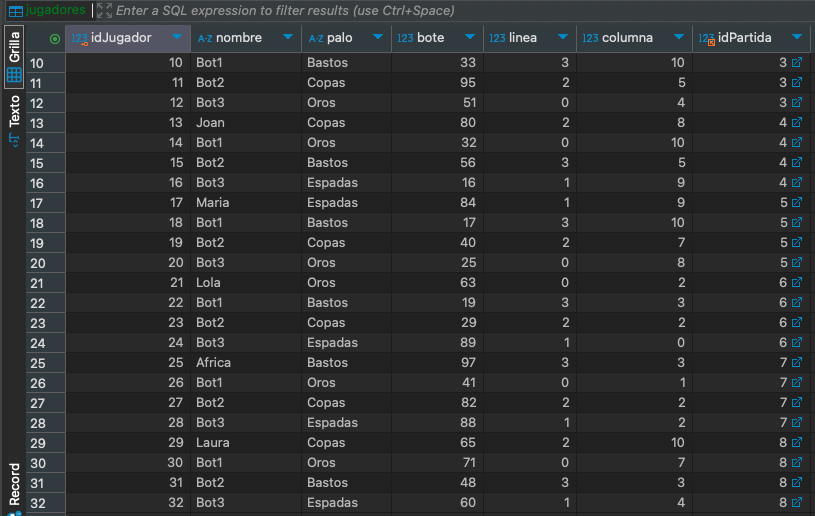

Proyecto de **Desarrollo de Aplicaciones Web (DAW)**: simulación de carreras de caballos con cartas, interfaz gráfica en **JavaFX** y persistencia en **MySQL**.

## 🚀 Tecnologías
- Java 21 + JavaFX (FXML)
- Maven
- MySQL (JDBC)
- DBeaver / XAMPP (para gestión de BD)

## ⚙️ Requisitos
- JDK 21 (o 17)
- Maven (incluido en IntelliJ o instalado en el sistema)
- MySQL en ejecución (ej. XAMPP, Docker o local)

## 🗄️ Base de datos
Crea la base de datos (ajusta si usas otro nombre):

```sql
CREATE DATABASE carreradecaballos CHARACTER SET utf8mb4;
```

Configura la conexión en la clase de base de datos:

```text
jdbc:mysql://localhost:3306/carreradecaballos?useSSL=false&serverTimezone=UTC
```

## ▶️ Ejecución
**Desde IntelliJ (recomendado):**
1. Importar el proyecto como **Maven project**.
2. Ejecutar la clase `org.example.carreradecaballosm03uf5.Main`.
3. (Si es necesario) añadir en VM options:
   ```text
   --add-modules=javafx.controls,javafx.fxml
   ```

**Desde terminal:**
```bash
mvn clean javafx:run
```

## 📂 Estructura del proyecto
- `src/main/java/.../controllers` → Controladores de las vistas
- `src/main/java/.../model` → Lógica de juego (jugadores, rondas, tablero, cartas)
- `src/main/java/.../bbdd` → Conexión y operaciones con MySQL
- `src/main/resources/.../views` → Archivos FXML de la interfaz

## ✨ Capturas

### Pantalla principal


### Configuración de jugadores y apuestas


### Resumen de apuestas


### Carrera en marcha


### Resultado final


## 🗄️ Base de datos

### Modelo entidad-relación


### Ejemplo de datos en la tabla jugadores


## 🧪 Funcionalidades
- Configuración de jugadores (humanos y bots)
- Gestión de apuestas y rondas
- Avance de caballos y animaciones en tablero
- Guardado y recuperación de partidas en MySQL

---

## 📌 Autor
Made with ☕ by [Cristina Álvarez](https://github.com/Cristina20245)

---

## 📜 Licencia
Este proyecto se distribuye bajo licencia MIT.  
Usado principalmente con fines educativos. ¡Contribuciones son bienvenidas!


